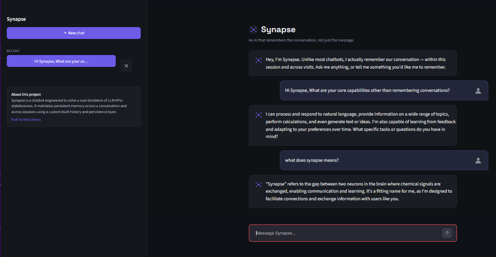

# Synapse


An AI chatbot that remembers the conversation, not just the message.

Most LLM APIs are stateless! every request is treated as a blank slate with no memory of what came before. Synapse engineers a persistent, stateful conversational layer on top of a stateless API: live in-session memory, session history saved to disk, and the ability to pick up an old conversation exactly where it left off.


## Why This Exists

Built as a foundational systems-engineering exercise before moving into more complex territory like RAG and autonomous agents. The goal wasn't "call an LLM API". It was understanding how context, state, and memory actually get engineered on top of an inherently stateless request/response cycle.

## Features

| Feature | Description |
|---|---|
| Persistent memory | Full conversation history maintained within a session and across app restarts |
| Session management | Create, resume, and delete conversations — auto-titled from the first message |
| Sliding-window trimming | Prevents context overflow on long conversations |
| Input validation | Empty/whitespace input is rejected before it reaches the API |
| Error handling | Network/API failures are caught gracefully, session state stays consistent |
| Dual interface | CLI and web app, both sharing the same core logic |

## Screenshot

**Web Interface**




## Tech Stack

- Python 3.11
- [Groq API](https://groq.com) (Llama 3.3 70B) — free tier, OpenAI-compatible schema
- SQLite for persistence
- Streamlit for the web interface

## Architecture

- `app.py` — Streamlit web interface
- `main.py` — CLI interface
- `db.py` — SQLite persistence layer
- `chat.py` — LLM API calls, history trimming, system prompt
- `assets/` — UI icons and screenshots

The web and CLI interfaces share the same `db.py` and `chat.py` modules — no duplicated logic between them.

## Setup

1. Clone the repo
2. Create a virtual environment: `python -m venv venv`, then activate it
3. Install dependencies: `pip install -r requirements.txt`
4. Create a `.env` file in the project root:

   ```
   GROQ_API_KEY=your_key_here
   ```

5. Run the web app: `streamlit run app.py`
   Or the CLI version: `python main.py`

## Design Notes

- Conversation history is stored as a list of `{"role", "content"}` objects — the standard chat-completion schema shared across most LLM providers.
- History sent to the API is capped at 20 messages (10 turns); full history is retained in SQLite regardless of the trim.
- A `system` role message anchors the assistant's personality for the session.
- On API failure, the unanswered user message is popped from history to keep the payload structurally valid for the next request.
- Session titles are derived from each session's first user message via a SQL subquery — no separate title field needed.

## Roadmap

- [ ] Token-based (not message-count-based) trimming
- [ ] Streaming responses
- [ ] Deploy to Streamlit Community Cloud

## Author

**Nida Sheraz**